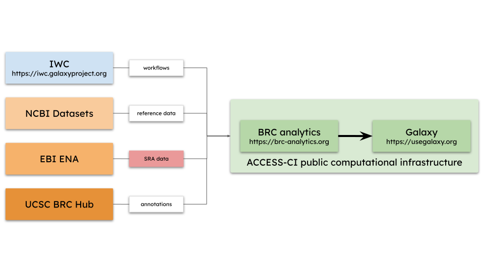

# Standardizing RNA-seq Analysis of Fungal Pathogens Using BRC-Analytics and Agentic AI

### A *Candidozyma auris* Case Study

**Nekrutenko et al.**

---

# The *C. auris* Threat

- First isolated 2009 (Japan), now global spread
- **CDC urgent threat** — first fungal pathogen with this designation
- Multidrug resistance (often to ALL major antifungal classes)
- **30-60% mortality rates**
- Persists on surfaces, forms biofilms on medical devices
- WHO critical-priority pathogen

---

# *C. auris* Sequencing Landscape

| Assay | BioProjects | Runs |
|-------|-------------|------|
| WGS | 168 | 26,201 |
| RNA-seq | 64 | 812 |

- WGS: outbreak surveillance (avg 156 runs/project)
- RNA-seq: academic research (avg 13 runs/project)
- **27% of projects are RNA-seq — standardization is priority**

---

# The Methodology Problem

Survey of 20 published RNA-seq studies:

| Category | Finding |
|----------|---------|
| **Reference Genome** | 60% use B8441, but versions vary |
| **Tools** | HISAT2 (7), STAR (5), DESeq2 (12) |
| **Version reporting** | Often incomplete or absent |

**Result**: Reproducibility challenges, cross-study comparison difficult

---

# Our Solution

## BRC-Analytics + Galaxy + Agentic AI

- Standardized workflows with **locked versions**
- **Automatic provenance** tracking
- Natural language interaction via **Claude Code Agent**

---

# BRC-Analytics Platform

- **Browser-based** — no local installation
- NIAID-funded Bioinformatics Resource Centers
- Data sources:
  - NCBI Datasets (5,060 assemblies)
  - UCSC Genome Browser
  - EBI ENA
- **IWC community-curated workflows**
- ACCESS-CI infrastructure at TACC

---

# BRC-Analytics Platform

---

# Two Validation Studies

| Study | Key Finding | BioProject |
|-------|-------------|------------|
| Santana 2023 (*Science*) | SCF1 adhesin for biofilm/virulence | PRJNA904261 |
| Wang 2024 (*Nat Comm*) | Glycan-lectin in colonization | PRJNA1086003 |

**Both**: B8441 reference, modern tools, adhesion phenotypes

---

# Why Agentic AI?

Two aspects of biological data analysis **resist automation**:

1. **SRA ↔ Manuscript mapping**
   Sample groupings, replicates rarely obvious from metadata

2. **Cross-version comparison**
   Different genome annotations = different gene IDs

Standard workflows can't solve these

---

# Why NOT Web-Based LLMs?

### ChatGPT, Claude, Gemini in browser
- Artifacts hard to track, version, reproduce

### Claude Code, Gemini Code Assist (local)
- All artifacts preserved locally
- Git versioning
- Can interact with Galaxy API

---

# Our Setup

**Claude Code Agent (CCA)**
- Configured with Galaxy API key
- Runs on local machine
- All interactions recorded

**Verification protocol**:
1. CCA proposes plan
2. Human reviews/modifies
3. CCA executes

---

# Organizing Data with CCA

**Prompt**: *"Split Galaxy collection #244 into conditions from manuscript..."*

**CCA**:
- Downloads SRA metadata
- Reads manuscript PDFs
- Maps accessions → experimental conditions
- Creates labeled collections in Galaxy

---

# The Annotation Challenge

| Version | Gene ID format |
|---------|----------------|
| Published studies | B9J08_**001458** (6-digit) |
| Current GCA_002759435.3 | B9J08_**03708** (5-digit) |

**Solution**: NCBI official `old_locus_tag` mapping
- GTF file contains authoritative gene ID correspondence
- Validated by **100% protein sequence identity**

---

# AI Mistake: LFC Correlation

Initially CCA proposed matching genes by similar fold-change values:
- **Appeared successful**: R² = 0.9996
- **Actually wrong**: Only 1% of matches correct (2/203)

High R² was coincidental—genes with similar LFC by chance

**Lesson**: Validate AI outputs against authoritative sources

---

# Santana et al. Validation

| Comparison | Genes | R² | Direction |
|------------|-------|-----|-----------|
| tnSWI1 vs AR0382 | 203 | 0.94 | 99% |
| AR0387 vs AR0382 | 165 | 0.89 | 97% |

**SCF1**: -6.68 (pub) vs -6.82 (ours)

---

# Wang et al. Validation

| Condition | Genes | R² | Direction |
|-----------|-------|-----|-----------|
| In vitro | 76 | **0.98** | 100% |
| In vivo | 259 | **0.9998** | 100% |

**Strong correlation with official mapping**

---

# The Provenance Problem

AI agents can bypass Galaxy's tracking:
- Direct API manipulation → loses reproducibility
- External scripts → not in Galaxy history

**Our solution**:
- Constrain CCA to use **Galaxy tools via API**
- Custom code → **JupyterLite notebooks** (AI-free)

---

# Key Results

| Metric | Result |
|--------|--------|
| Santana correlation | R² = 0.89-0.94 |
| Wang correlation | R² = 0.98-0.9998 |
| SCF1 finding | Confirmed |
| Official NCBI mapping | Works across annotation versions |
| Provenance | Maintained via Galaxy + notebooks |

---

# LLMs for Reproducible Research

### Do:
- Use **agentic tools** (Claude Code, Gemini Code Assist)
- Automatic artifact tracking
- Version-controlled repositories

### Don't:
- Use chat interfaces for research
- Browser-based Claude/ChatGPT lose provenance

---

# Why Galaxy for AI Integration?

| Feature | Galaxy | Nextflow |
|---------|--------|----------|
| Tool metadata | Structured XML | Parse docs/source |
| API | Stateful | Log parsing |
| HPC access | ACCESS-CI (free) | Configure manually |
| Interface | Browser-based | Command-line |

**AI agents work better with structured APIs**

---

# Future Vision

**Current**: Manual coordination between BRC-Analytics, Galaxy, CCA

**Future**: AI embedded in Galaxy
- Natural language → workflow selection
- Automatic parameter configuration
- Result interpretation
- Full provenance maintained

---

# Conclusions

1. **BRC-Analytics** enables standardized pathogen genomics
2. **Agentic AI** handles non-automatable tasks
3. **Local AI tools** (not web chat) preserve provenance
4. **Galaxy's structured API** enables AI integration
5. **First integration** of data repos + workflows + agentic AI

---

# Thank You

**Resources**:
- BRC-Analytics: https://brc-analytics.org
- Galaxy histories: usegalaxy.org
- Code: github.com/nekrut/claude-projects

**Contact**: aun1@psu.edu, spond@temple.edu
