# Launching C. auris RNA-seq Analysis via BRC-Analytics

This guide describes how to launch a transcriptomics workflow for *Candidozyma auris* using BRC-Analytics and Galaxy.

## Overview

BRC-Analytics (https://brc-analytics.org) provides a streamlined interface for selecting organism-specific sequencing data from NCBI SRA and launching analysis workflows directly in Galaxy.

## Steps

### 1. Navigate to BRC-Analytics

Go to https://brc-analytics.org and click **Organisms**.

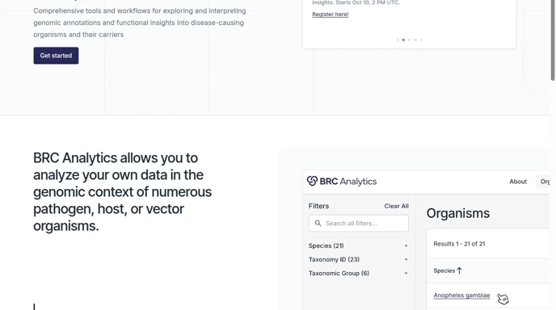

### 2. Select Organism

Search for "candida" in the filter field and select **Candidozyma (Candida) auris**.

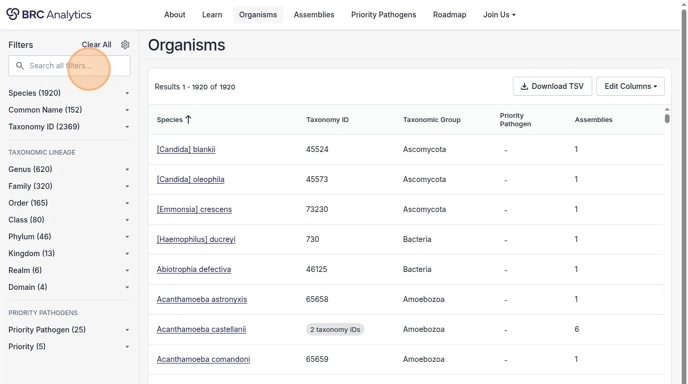

### 3. Access Analysis Options

Click on **Candidozyma auris**, then click **Analyze**.

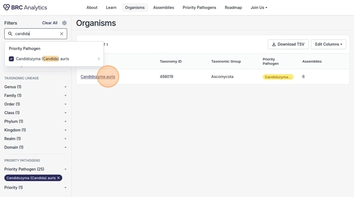

### 4. Choose Analysis Type

Select **Transcriptomics**.

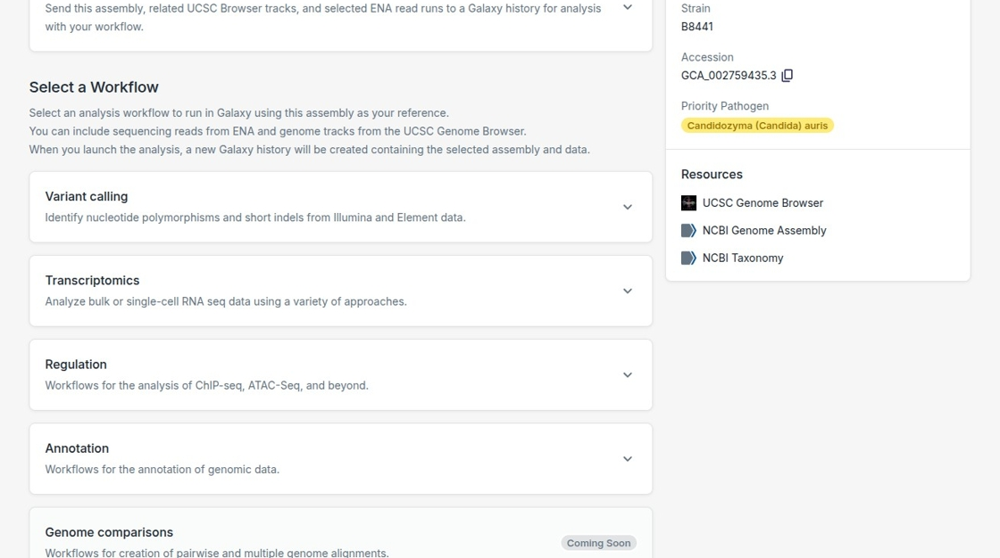

### 5. Configure Workflow Inputs

Click **Configure Inputs**, then **Continue**.

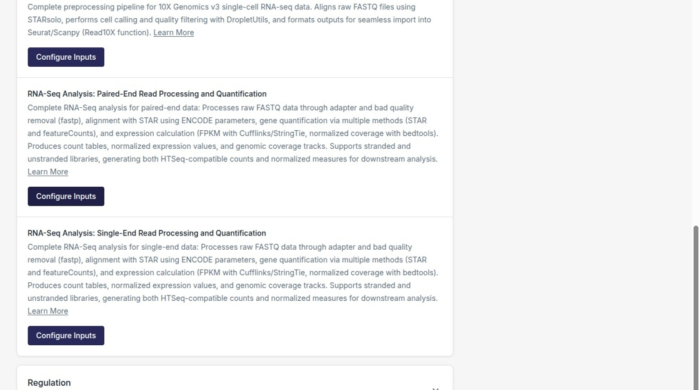

### 6. Browse Available Sequences

Click **Browse Sequences** to access available SRA data.

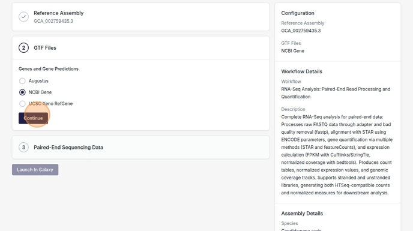

### 7. Filter by Study Accession

Use **Study Accession** filter to find specific BioProjects. Select desired runs using checkboxes.

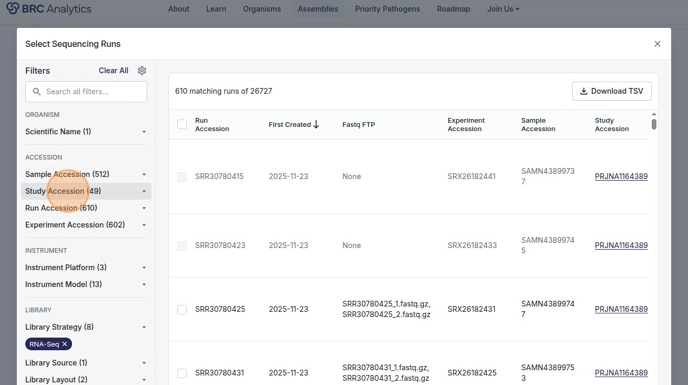

### 8. Add Sequencing Runs

Click **Add N Sequencing Runs** to add selected data.

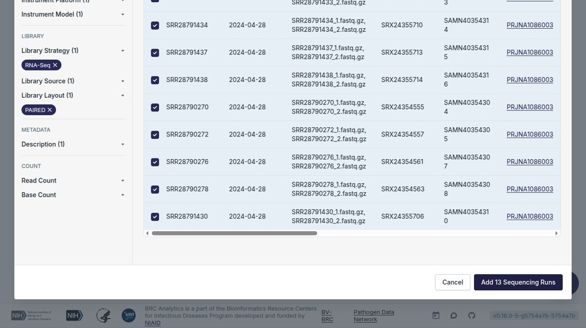

### 9. Launch in Galaxy

Click **Launch In Galaxy** to open Galaxy with pre-configured workflow.

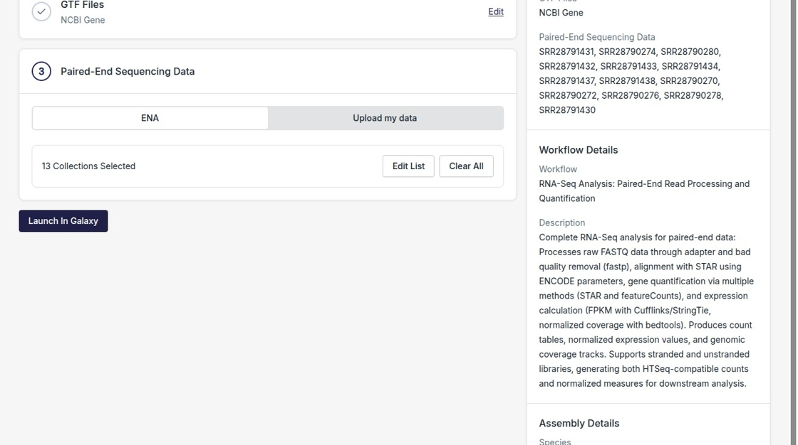

### 10. Access Workflow

Click the workflow icon to view workflow details.

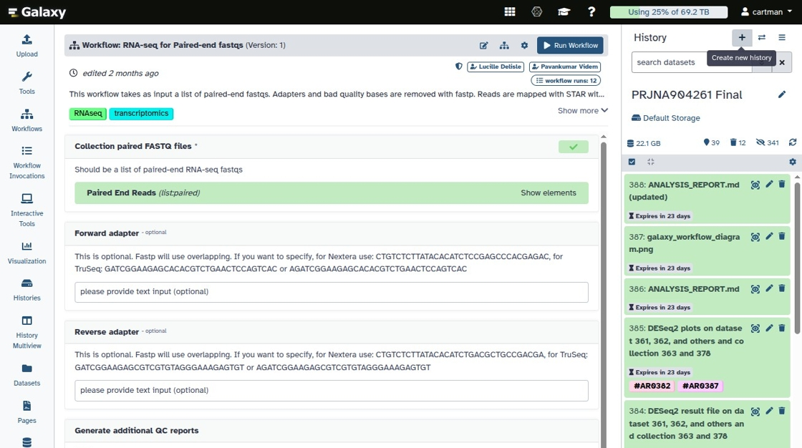

### 11. Execute Workflow

Click **Run Workflow** to start the analysis.

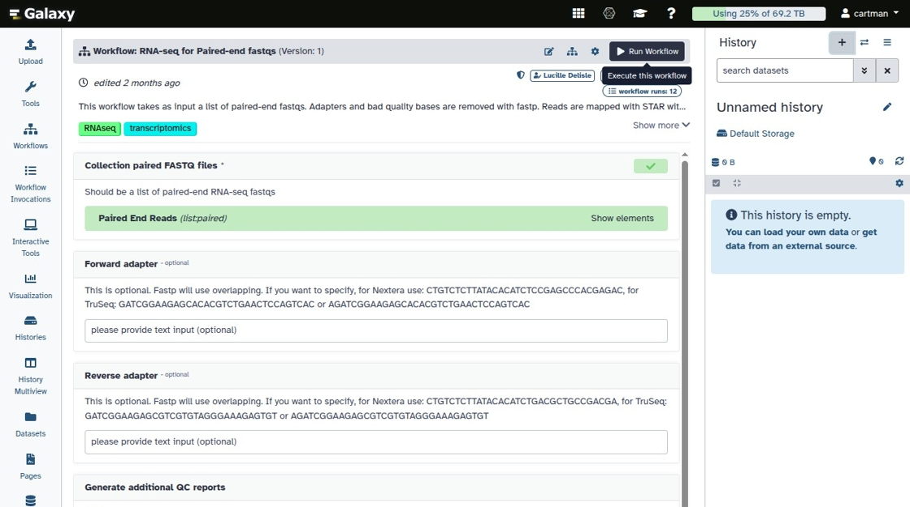

## Result

After completion, Galaxy history contains:

- Quality-controlled reads (fastp)
- Aligned reads (STAR)
- Gene counts (featureCounts)
- Ready for differential expression analysis (DESeq2)

## Source

[Original Scribe tutorial](https://scribehow.com/shared/Analyze_Candida_Auris_Transcriptomics_Data_in_Galaxy__D4ag4Ad2SLulHK_mvPCidw) by Anton Nekrutenko
